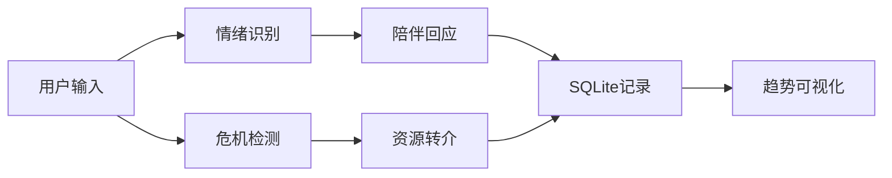

# 项目12 PPT 大纲：AI 陪聊情绪树洞

## 第1页：标题页

**AI 陪聊情绪树洞：情绪识别与心理资源转介助手**  
课程：人工智能引论大项目  
成员：填写小组成员  
关键词：情绪识别、支持性回应、危机转介、可解释 AI

## 第2页：项目背景

- 大学生面临学业、人际、就业等多重压力。
- 现实中很多人不愿第一时间向他人倾诉。
- 匿名树洞可以降低表达门槛。
- AI 可以辅助完成情绪识别、陪伴回应和资源推荐。

讲解重点：项目不是替代心理咨询，而是提供早期表达和转介入口。

## 第3页：需求分析

根据项目12要求，实现六个功能：

1. 匿名情绪树洞
2. 情绪识别
3. 陪伴式回应
4. 情绪记录
5. 自我照护建议
6. 危机词报警

## 第4页：系统架构

展示流程图：

讲解重点：普通情绪和高风险表达分流处理。

## 第5页：核心算法：情绪识别

- 使用情绪词典和规则加权。
- 支持焦虑、低落、愤怒、孤独、压力、平静、积极。
- 输出情绪标签、置信度和解释。
- 优点：可解释、稳定、易部署。

可展示例子：

输入：“项目DDL太多，晚上睡不着。”  
输出：“压力/焦虑，置信度 0.xx。”

## 第6页：核心算法：危机词报警

- 检测自伤、自杀、暴力、极端绝望表达。
- 一旦触发，不继续普通陪聊。
- 显示安全提醒和现实资源。
- 引导用户联系真人、学校心理中心、120/110/12356。

讲解重点：安全边界是本项目的重要设计。

## 第7页：陪伴式回应设计

回应原则：

- 温和、共情、非评判
- 不做医学诊断
- 提供小步骤建议
- 鼓励联系现实支持
- 可选接入 DeepSeek API

展示一段系统回复截图或文本。

## 第8页：数据存储与趋势可视化

- SQLite 保存匿名记录
- Plotly 展示情绪分布柱状图
- 折线图展示置信度变化
- 支持 CSV 导出

讲解重点：从单次陪聊扩展为持续情绪观察。

## 第9页：系统演示

演示流程：

1. 输入一段焦虑/压力文本。
2. 查看情绪识别结果。
3. 查看陪伴式回应和建议。
4. 打开趋势页查看图表。
5. 输入高风险样例，展示危机转介提示。

## 第10页：创新点

1. 匿名树洞 + 情绪识别 + 陪伴回应 + 危机转介闭环。
2. 本地可运行与大模型增强兼容。
3. 可解释情绪识别，便于答辩展示。
4. 安全优先，区分普通陪伴和高风险处理。
5. 适合校园心理支持场景。

## 第11页：不足与改进

不足：

- 关键词识别对复杂语境理解有限。
- 危机词可能误报或漏报。
- 本地模板回复不如大模型自然。
- 隐私保护仍需加强。

改进：

- 微调情绪分类模型。
- 建设校内心理资源 RAG 知识库。
- 增加语音输入和移动端。
- 引入人工审核机制。

## 第12页：总结

- 项目完成了课程要求的核心功能。
- 技术方案简单、稳定、可解释。
- 体现 AI 在校园心理支持中的辅助价值。
- 最重要原则：AI 做陪伴和转介，不替代专业帮助。
