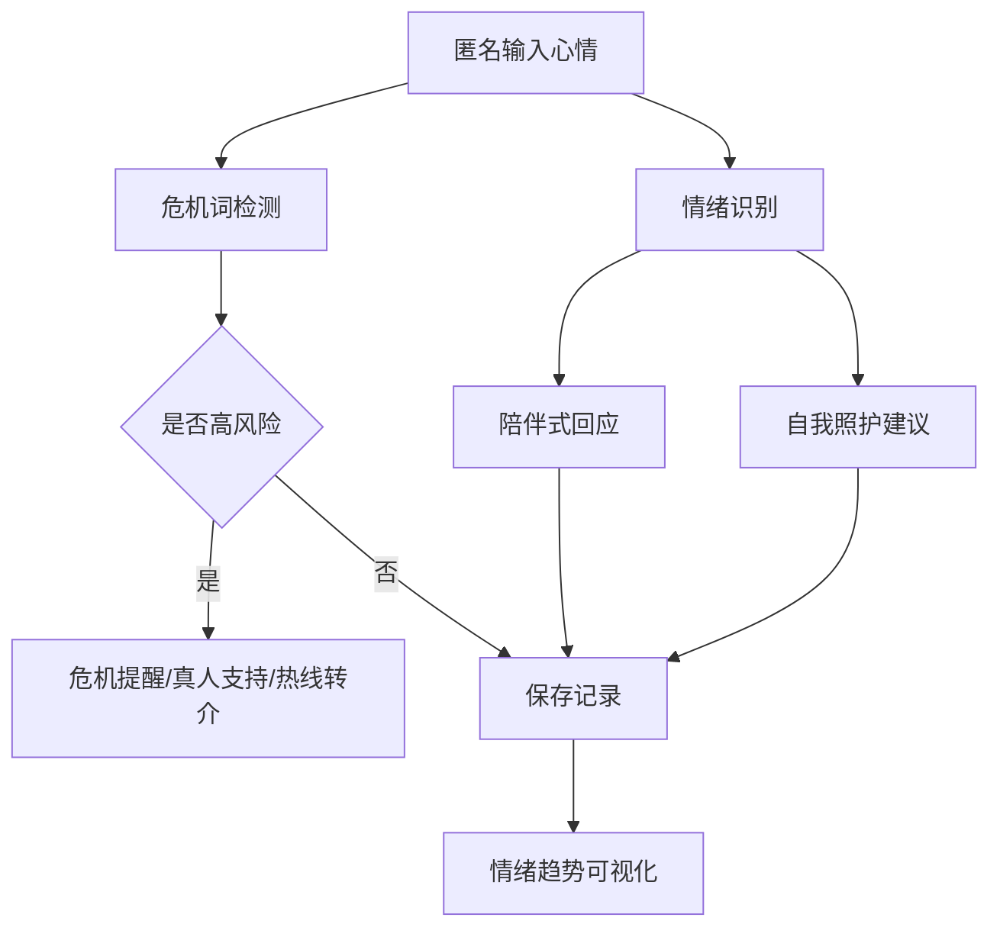

# 易拉宝/海报内容建议

## 主标题

AI 陪聊情绪树洞  
情绪识别与心理资源转介助手

## 一句话简介

一个面向大学生的匿名情绪表达 Web 工具，可识别情绪、生成陪伴式回应、记录趋势，并在高风险表达时提供现实资源转介。

## 背景痛点

- 大学生常面临考试、DDL、人际和就业压力。
- 负面情绪不一定会被及时表达。
- 普通聊天机器人可能缺少安全边界。
- 校园场景需要低门槛、可解释、可转介的情绪支持入口。

## 系统流程图

## 核心功能

1. 匿名情绪树洞  
   用户输入烦恼、压力、日常心情。

2. 情绪识别  
   支持焦虑、低落、愤怒、孤独、压力、平静、积极等类别。

3. 陪伴式回应  
   生成温和、共情、非评判的文字回应。

4. 情绪记录  
   SQLite 保存历史记录，形成情绪趋势。

5. 自我照护建议  
   推荐呼吸练习、休息、写日记、联系朋友等小步骤。

6. 危机词报警  
   检测自伤、自杀、极端绝望等高风险表达，提示联系现实资源。

## 技术路线

- Streamlit：Web 交互界面
- Python：核心逻辑
- SQLite：本地记录
- Pandas + Plotly：数据分析与可视化
- 情绪词典 + 规则加权：可解释情绪识别
- DeepSeek API：可选生成式陪伴回应
- 危机词表：安全转介机制

## 创新亮点

- “树洞表达—情绪识别—陪伴回应—趋势记录—危机转介”闭环设计。
- 本地可运行，不依赖外部 API，现场展示稳定。
- 情绪识别结果可解释，适合教学和答辩。
- 关注 AI 心理应用安全边界，强调真人支持和专业转介。

## 演示样例

输入：

> 最近期末考试和项目 DDL 挤在一起，我总觉得来不及，晚上睡不着。

输出：

- 情绪：焦虑/压力
- 建议：拆分任务、做呼吸练习、先完成最小可提交版本
- 回应：承认压力，提供支持，鼓励联系现实支持资源

## 结论

本项目展示了人工智能在校园心理支持场景中的应用潜力。系统不替代心理咨询，而是作为低门槛表达入口和风险转介助手，帮助用户更早看见情绪、记录情绪并寻找支持。
