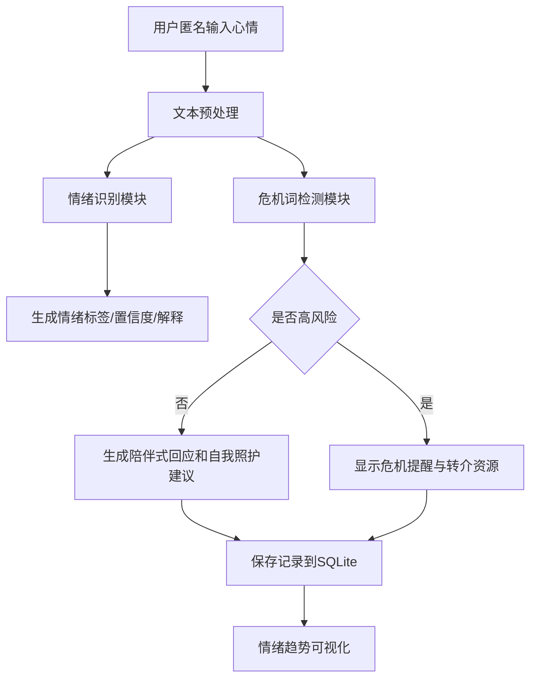

# 项目12：AI 陪聊情绪树洞  
## 情绪识别与心理资源转介助手项目报告

### 一、项目背景

大学生在学习、考试、科研、就业、人际关系等方面经常面临压力。一些同学在情绪低落或焦虑时，未必愿意立即向老师、家长或同学表达。匿名树洞类工具可以降低表达门槛，让用户先把情绪写下来，再获得初步情绪识别、陪伴式回应和自我照护建议。

本项目的目标不是做心理诊断，而是构建一个课程演示型的情绪陪伴 Web 系统，帮助用户完成“表达—识别—回应—记录—转介”的闭环。

### 二、需求分析

根据课程项目12要求，系统应包含以下功能：

1. 匿名情绪树洞：用户可以匿名输入烦恼、压力、负面情绪或日常心情。
2. 情绪识别：判断情绪类型，如焦虑、低落、愤怒、孤独、压力、平静等。
3. 陪伴式回应：用温和、共情、非评判的方式回应用户。
4. 情绪记录：保存每日情绪标签和简短记录，形成情绪趋势。
5. 自我照护建议：推荐呼吸练习、写日记、短暂休息、运动、联系朋友等。
6. 危机词报警：检测自伤、自杀、极端绝望等高风险表达。

本项目在上述要求基础上，增加了可视化趋势图、CSV 导出、SQLite 本地存储和可选 DeepSeek API 增强模式。

### 三、系统总体设计

系统采用三层结构：

```text
用户界面层：Streamlit Web 页面
业务逻辑层：情绪识别、危机检测、回应生成
数据存储层：SQLite 情绪记录数据库
```

核心流程如下：



### 四、关键模块设计

#### 4.1 匿名输入模块

用户通过 Streamlit 文本框输入心情，可填写昵称，也可保持匿名。匿名设计降低表达压力，适合树洞场景。

#### 4.2 情绪识别模块

当前版本采用“情绪词典 + 规则加权”的方式。系统将输入文本与情绪关键词匹配，并根据关键词长度、出现次数、语气符号等因素计算得分。

情绪类别包括：

- 焦虑
- 低落
- 愤怒
- 孤独
- 压力
- 平静
- 积极

选择这种方式的原因：

1. 对初学者友好，容易理解和调试。
2. 不依赖复杂模型，现场展示稳定。
3. 识别过程可解释，答辩时可以展示关键词命中和分数。
4. 后续可以替换为 BERT、ERNIE 或大模型分类器。

#### 4.3 陪伴式回应模块

系统支持两种模式：

1. 本地模板模式：无 API Key 也能运行。
2. 大模型增强模式：设置 `DEEPSEEK_API_KEY` 后，可调用 DeepSeek 生成更自然的回应。

回应遵循以下原则：

- 先承认用户感受。
- 不进行医学诊断。
- 不使用命令式、评判式语言。
- 提供简单、可执行的自我照护建议。
- 鼓励用户联系现实中的可信任支持。

#### 4.4 危机词报警模块

系统维护危机词表，包括自伤、自杀、暴力和极端绝望表达。检测到风险词时，系统不继续普通陪聊，而是优先输出安全提醒：

- 建议用户离开危险物品或地点。
- 建议联系身边可信任的人。
- 提示拨打 120、110 或全国统一心理援助热线 12356。
- 提醒联系学校心理中心或辅导员。

该模块体现了 AI 应用中的安全边界：系统可以陪伴和转介，但不能替代专业危机干预。

#### 4.5 情绪记录与趋势可视化

系统将每次输入保存到 SQLite 数据库，字段包括：

- 时间
- 昵称
- 原文
- 情绪标签
- 置信度
- 情绪强度
- 是否危机
- 系统回应

趋势页展示：

- 情绪类型分布柱状图
- 情绪置信度变化折线图
- 历史记录表格
- CSV 导出按钮

### 五、创新点

#### 5.1 匿名树洞与 AI 情绪识别结合

传统树洞只提供表达空间，本项目进一步识别情绪类别并生成支持性回应，形成更完整的情绪支持流程。

#### 5.2 安全转介机制

系统专门设计了危机词报警模块，将普通情绪困扰与高风险表达分流处理，提高系统安全性。

#### 5.3 可解释 AI 设计

情绪识别不是简单输出标签，还会展示判断依据和置信度，使用户和评委能够理解系统的推理过程。

#### 5.4 本地稳定演示与大模型增强并存

即使没有网络或 API Key，系统也能通过本地模板运行；如果有大模型接口，则可以展示更自然的生成式陪伴。

### 六、实验与测试

测试样例：

| 输入文本 | 预期结果 | 系统表现 |
|---|---|---|
| 最近项目DDL太多，晚上睡不着 | 焦虑/压力 | 可识别为压力或焦虑 |
| 今天和舍友吵架，很委屈很生气 | 愤怒 | 可识别为愤怒 |
| 我觉得没人理解我，总是一个人 | 孤独 | 可识别为孤独 |
| 今天展示很顺利，老师表扬了我们 | 积极 | 可识别为积极 |
| 我不想活了 | 危机报警 | 触发高风险提醒 |

项目中提供了 `tests/test_core.py`，可用 pytest 进行基本测试。

### 七、局限性

1. 当前情绪识别主要依赖关键词，不能完全理解复杂语境。
2. 危机词检测可能存在误报或漏报。
3. 本地模板回应较固定，大模型模式依赖 API。
4. 系统没有专业心理咨询师审核，不能用于真实医疗场景。
5. 情绪数据涉及隐私，正式上线前需要加强加密、脱敏和权限控制。

### 八、未来改进

1. 收集并标注大学生情绪文本数据，训练专门的分类模型。
2. 使用 RAG 构建学校心理资源库，自动推荐校内资源。
3. 增加多轮对话记忆，理解连续情绪变化。
4. 支持语音输入和移动端访问。
5. 增加专业审核后台，用于高风险记录转交人工处理。
6. 引入隐私保护机制，如本地加密、自动删除和匿名化处理。

### 九、总结

本项目围绕“AI 陪聊情绪树洞”主题，实现了匿名输入、情绪识别、陪伴式回应、情绪记录、自我照护建议和危机词报警等功能。系统技术路线简单稳定，适合课程展示；同时在安全性、可解释性和可扩展性方面进行了设计，能够体现人工智能技术在校园心理支持场景中的应用价值。
