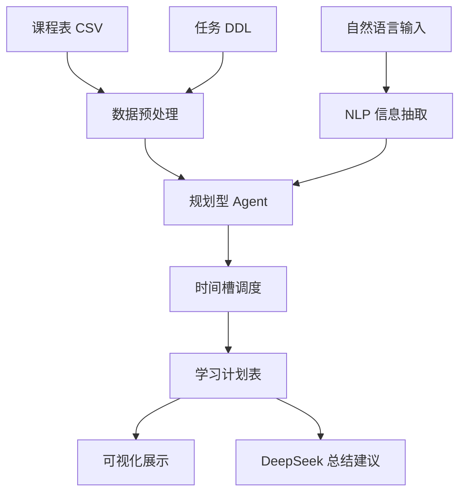

# 海报/易拉宝文案

## 标题

AI 智能课表与学习计划生成系统

## 一句话简介

面向大学生的智能时间管理工具：导入课程表和任务 DDL，自动生成一周可执行学习计划。

## 背景痛点

- 课程、作业、考试和项目任务分散
- DDL 容易遗漏，临近截止才赶工
- 手工计划难以兼顾课程占用和个人空闲时间
- 缺少可解释、可复盘的学习规划工具

## 系统功能

1. 课程表导入  
2. 作业/考试/项目 DDL 管理  
3. 中文自然语言任务解析  
4. 智能优先级排序  
5. 一周学习计划生成  
6. 每日学习时长可视化  
7. AI 学习建议与风险提醒  
8. CSV/Markdown 导出

## 技术路线

## 核心算法

- 中文时间解析：识别“下周三”“5月20日”“晚上10点”
- 优先级评分：综合重要程度和 DDL 紧急程度
- 时间槽扣除：从空闲时间中扣除课程占用
- 任务拆分：将长任务拆成 30-120 分钟学习块
- 风险提示：可用时间不足时输出预警

## 创新点

1. 将课表、任务和空闲时间统一建模
2. 支持自然语言输入，降低使用门槛
3. 使用规划型 Agent 思路主动生成计划
4. 兼顾规则算法稳定性和大模型表达能力
5. 输出结果可解释，便于用户执行和复盘

## 应用价值

- 帮助学生减少拖延
- 提高 DDL 管理效率
- 让学习计划更细化、更可执行
- 可扩展到飞书日历、消息推送和学习打卡

## 展示建议

海报中间放系统流程图，右侧放系统截图，底部放一周学习计划示例表格和每日学习时长柱状图。
