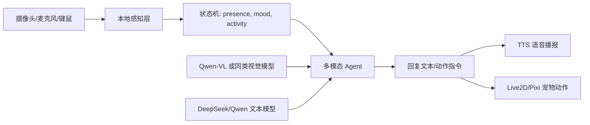

# 项目39：结合 BongoCat 的具身 AI 桌面宠物

这是一个面向《人工智能引论》项目39的可运行原型。它参考了 [ayangweb/BongoCat](https://github.com/ayangweb/BongoCat) 的桌面宠物产品形态：常驻桌面、响应键鼠输入、可自定义形象、跨平台桌面应用。当前版本先用纯前端实现 MVP，方便课堂展示；后续可迁移进 BongoCat 的 Tauri + Vue 技术栈。

## 已实现能力

- 桌面宠物动画：待机、输入同步、观察、鼓励、休息、思考等状态。
- BongoCat 式键鼠反馈：键盘、鼠标、模拟动作会驱动宠物动作变化。
- 本地摄像头感知：在浏览器内计算亮度、动作强度，并尽量使用 FaceDetector 检测人脸数量。
- 对话与语音：支持文本聊天、浏览器语音播报，Chrome/Edge 下可尝试语音输入。
- 多模态接口预留：可保存当前摄像头快照，配置 OpenAI 兼容接口后把文本和图像一并发送给支持 vision 的模型。
- 提交材料：`docs/project-report.md` 是项目报告，`docs/poster-content.md` 是海报展览可直接改写的内容。

## 运行方式

方式一，本地服务（推荐）：

```powershell
cd C:\Users\12808\Documents\Codex\2026-05-13\files-mentioned-by-the-user-1-2\project39-bongocat-ai
npm start
```

然后访问 `http://localhost:4173`。摄像头和语音能力建议通过本地服务运行，浏览器权限更稳定。

方式二，Windows 一键启动：

双击 `start-demo.bat`，脚本会启动本地服务，等待页面可访问后自动打开浏览器。

方式三，直接打开：

1. 打开 `index.html`。
2. 文本聊天和键鼠动作可直接演示。
3. 如需摄像头或语音权限，请改用本地服务方式。

## 与 BongoCat 的结合方式

BongoCat 仓库提供了一个成熟的桌面宠物底座，适合承接本项目的桌面端实现：

- 桌面壳层：BongoCat 使用 Tauri，能做透明窗口、置顶窗口和跨平台打包。
- 前端层：Vue/TypeScript 负责 UI 和状态管理，本原型的 Agent 状态机可迁移为 composable/module。
- 宠物表现层：BongoCat 使用 Live2D/Pixi 相关能力，本项目可把 `idle/typing/curious/cheer/sleepy/thinking` 映射到 Live2D 动作与表情。
- 输入事件层：BongoCat 已有键盘、鼠标、手柄动作同步思路，本项目在此基础上增加摄像头、语音和大模型 Agent。

建议迁移模块：

```text
src/modules/ai-pet/perception.ts      摄像头帧采样、亮度/动作/人脸状态
src/modules/ai-pet/agent.ts           状态机与 LLM prompt 编排
src/modules/ai-pet/voice.ts           ASR/TTS 接入
src/modules/ai-pet/modelClient.ts     DeepSeek/Qwen/OpenAI 兼容接口
src/components/AiPetPanel.vue         设置面板与状态展示
src-tauri/src/permissions.rs          摄像头、麦克风、全局输入权限说明
```

## AI 技术路线



## 课堂演示脚本

1. 打开页面，展示桌宠待机状态。
2. 点击 K/M/A/Z 或直接敲键盘，展示输入同步和动作反馈。
3. 开启摄像头，说明画面只在本地分析，展示亮度、动作、人脸状态。
4. 询问“你现在观察到了什么”，展示宠物依据状态回复。
5. 点击快照按钮，说明后续可接入 Qwen-VL，把画面作为多模态上下文。
6. 展示报告中的系统架构和评测方案。

## 参考来源

- BongoCat: https://github.com/ayangweb/BongoCat
- 项目39课件要求：具身 AI 桌面宠物，摄像头感知、语音、多模态大模型互动。
- 推荐模型方向：Qwen-VL / DeepSeek / OpenAI-compatible vision API。

本原型没有复刻或盗用 BongoCat 官方宠物资产，仅借鉴其桌面宠物产品形态和工程栈方向。
