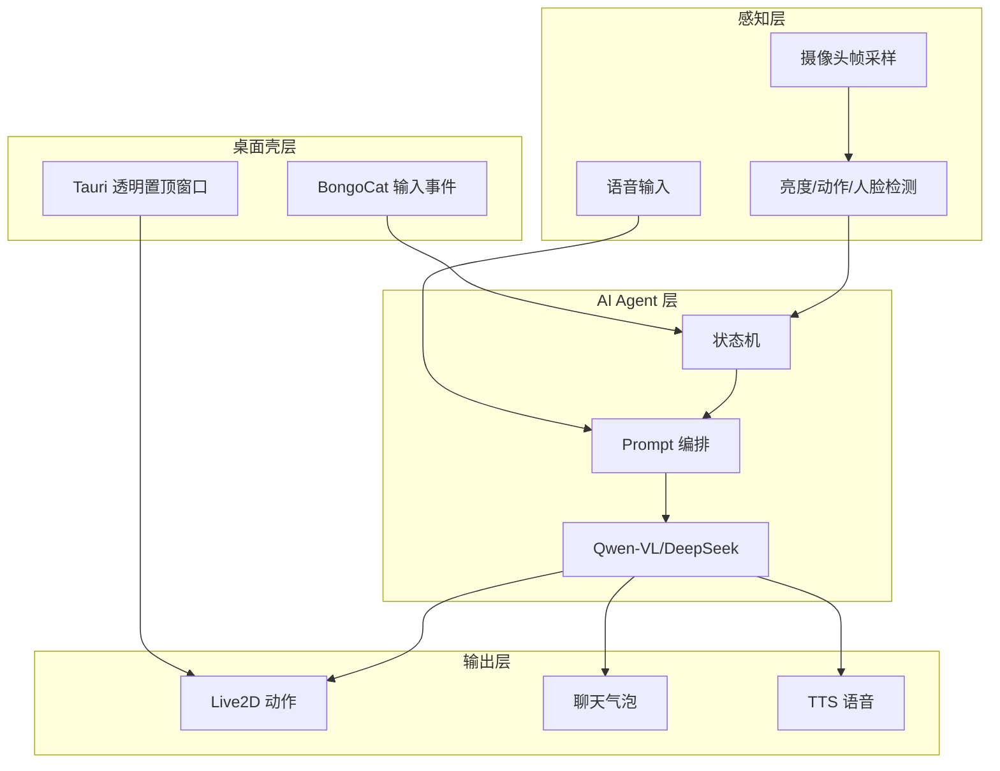

# 项目39报告：基于 BongoCat 的具身 AI 桌面宠物

## 1. 项目背景

传统桌面宠物通常只能执行预设动画，缺少对用户状态和真实环境的理解。BongoCat 这类桌面宠物证明了“常驻桌面 + 输入动作同步”的交互形态有很强的陪伴感。本项目在此基础上加入摄像头感知、语音交互和多模态大模型，使桌宠从装饰性角色升级为具备感知、对话、反馈和轻量陪伴能力的具身 AI Agent。

## 2. 项目目标

构建一个可在电脑桌面或小屏设备中运行的具身 AI 桌面宠物。系统能够感知用户是否在屏幕前、环境是否偏暗、是否有明显动作，并通过聊天、语音播报、表情和动作做出反馈。最终版本可迁移到 BongoCat 的 Tauri 桌面壳层，实现透明置顶窗口、全局输入监听、Live2D 动作驱动和跨平台打包。

## 3. 系统功能

| 模块 | 当前 MVP | 完整版扩展 |
| --- | --- | --- |
| 宠物表现 | CSS 动画状态机 | Live2D/Pixi 模型、动作库、表情库 |
| 输入同步 | 键盘/鼠标/按钮触发 | BongoCat 全局键鼠/手柄监听 |
| 视觉感知 | 亮度、动作、人脸数量 | Qwen-VL 场景理解、姿态/表情识别 |
| 对话 Agent | 本地规则 + 可选模型接口 | DeepSeek/Qwen 多轮对话、长期记忆 |
| 语音交互 | Web Speech TTS/ASR | EdgeTTS、Whisper/FunASR、离线语音 |
| 隐私保护 | 摄像头本地分析 | 本地优先，上传前显式授权和脱敏 |

## 4. 技术架构

## 5. 核心算法与实现

### 5.1 本地状态感知

当前原型在浏览器内对摄像头画面降采样，计算平均亮度和相邻帧亮度差。亮度用于判断低光环境，帧差用于判断画面动作强度。若浏览器支持 `FaceDetector`，则额外获取人脸数量，用于判断用户是否在屏幕前。

### 5.2 Agent 状态机

系统把输入事件和视觉指标转化为有限状态：

- `idle`：无明显输入或画面稳定。
- `typing`：检测到键盘、鼠标或按钮交互。
- `curious`：检测到用户在屏幕前或正在询问状态。
- `cheer`：用户活跃或需要鼓励。
- `sleepy`：长时间无输入、画面偏暗或用户离开。
- `thinking`：正在生成回复或处理视觉快照。

状态机会同时驱动宠物表情、动作、聊天气泡和语音播报。

### 5.3 多模态大模型接入

原型支持 OpenAI 兼容 `/chat/completions` 接口。若模型支持视觉输入，系统会把摄像头快照以 `image_url` 形式加入消息。实际部署时推荐：

- 视觉理解：Qwen-VL、InternVL、GPT-4o/4.1 vision 类模型。
- 文本对话：DeepSeek、Qwen、OpenAI 兼容文本模型。
- 语音识别：Whisper、FunASR。
- 语音合成：EdgeTTS、CosyVoice 或系统 TTS。

## 6. 创新点

1. 把 BongoCat 的输入同步桌宠形态升级为具身 AI Agent。
2. 采用“本地轻感知 + 可选云端多模态模型”的隐私友好架构。
3. 将视觉、键鼠、语音和大模型对话统一到一个宠物状态机中。
4. 可从浏览器 MVP 平滑迁移到 Tauri 桌面端，适合课程展示和后续工程化。

## 7. 实验与评测

| 指标 | 评测方法 | 目标 |
| --- | --- | --- |
| 摄像头响应延迟 | 开启摄像头后观察指标刷新 | 小于 1 秒 |
| 输入动作反馈 | 连续键盘/鼠标触发 | 动画能持续响应 |
| 状态判断合理性 | 低光、离开、动作场景测试 | 状态变化符合直觉 |
| 对话可用性 | 询问状态、功能、方案 | 回复能引用传感状态 |
| 隐私说明 | 展示权限与本地处理提示 | 用户能理解数据边界 |

## 8. 迭代计划

第 1 阶段：完成当前 Web MVP，验证桌宠状态机和演示流程。

第 2 阶段：迁移到 BongoCat/Tauri，接入透明窗口、全局输入监听和 Live2D 动作。

第 3 阶段：接入 Qwen-VL 和 DeepSeek，实现真实视觉理解与多轮对话。

第 4 阶段：加入长期记忆、课程提醒、学习陪伴、疲劳提醒和自定义宠物模型。

## 9. 项目分工建议

| 角色 | 任务 |
| --- | --- |
| 前端/桌面端 | BongoCat/Tauri 窗口、Live2D、设置面板 |
| AI/算法 | 摄像头感知、Qwen-VL/DeepSeek 接入、状态机 |
| 语音/交互 | ASR/TTS、对话体验、隐私提示 |
| 测试/展示 | 场景脚本、评测记录、海报和现场演示 |

## 10. 结论

本项目完成了项目39的核心闭环：虚拟宠物形象、用户状态感知、对话互动、语音反馈和可迁移桌面架构。BongoCat 提供了成熟桌面宠物底座，本原型补上了具身 AI 所需的感知和 Agent 层，为后续完整桌面应用开发打下基础。
