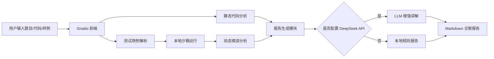

# CodeCoach-AI 编程题错解诊断与变式训练系统项目报告

## 1. 项目背景

在编程学习中，学生经常遇到“样例不过但不知道错在哪里”“看懂答案但不会迁移”“调试过程缺少复盘”的问题。传统在线评测系统只告诉用户通过或错误，缺少针对性的解释。因此，本项目设计一个面向大学生编程学习者的 AI 助教系统：用户输入题目、错解代码和测试样例，系统自动运行验证、定位可疑错误、生成讲解报告，并提供同类变式训练。

## 2. 项目目标

系统目标包括：

1. 自动运行用户代码，判断样例是否通过。
2. 结合静态分析和动态测试，定位常见错误类型。
3. 生成结构化 Markdown 诊断报告。
4. 根据题目类型推荐变式训练题。
5. 支持 DeepSeek 大模型增强讲解。

## 3. 系统架构

系统采用“前端交互 + 本地分析 + 可选 LLM 增强”的结构。

## 4. 核心技术

### 4.1 静态分析

Python 代码使用 AST 解析，识别语法错误、`range` 边界、浮点除法等问题。C++ 代码使用规则匹配，识别括号不匹配、`<= size()` 越界风险、整数范围、输入输出优化等问题。

### 4.2 动态测试

系统将用户代码写入临时目录，C++ 使用 `g++ -std=c++17` 编译，Python 使用本地解释器运行。每个测试样例单独执行，限制超时时间，并将实际输出与期望输出进行对比。

### 4.3 报告生成

系统将静态分析和动态测试结果整合为 Markdown 报告，包括：题目标签、样例通过情况、错误诊断、测试结果表、修复顺序和变式训练。

### 4.4 LLM 增强

如果用户配置 `DEEPSEEK_API_KEY`，系统会将本地诊断结果、题目和代码发送给 DeepSeek，生成更自然、教学性更强的讲解。未配置时仍可离线运行，保证演示稳定性。

## 5. 创新点

1. **静态分析 + 动态测试 + LLM 讲解融合**：不是单纯聊天机器人，而是先用可验证的程序运行结果约束大模型解释。
2. **面向学习闭环**：不仅指出错误，还生成变式题，帮助学生迁移巩固。
3. **离线可演示**：即使没有 API Key，仍能完成代码运行、错误发现和报告生成。
4. **适合课堂扩展**：后续可接入题库、错题本、学生学习档案，实现长期学习追踪。

## 6. 实验与验证

默认示例为“两数求和”题，错误代码将 `a+b` 写成 `a-b`。系统运行两个样例后发现均未通过，自动生成测试结果表，并提示用户优先检查实际输出与期望输出差异。

可进一步设计三类测试：

1. 普通样例：验证基本功能。
2. 边界样例：如 0、负数、最大范围。
3. 异常样例：触发运行时错误或超时，测试系统鲁棒性。

## 7. 不足与改进方向

当前版本是 MVP，仍有以下不足：

1. C++ 静态分析主要依赖规则匹配，后续可引入 tree-sitter 或 Clang AST。
2. 沙箱不是生产级安全沙箱，后续应使用 Docker 隔离和资源限制。
3. 变式题生成目前偏模板化，后续可接入题库和知识点标签体系。
4. 可增加代码自动修复、复杂度分析、错题本和学习画像功能。

## 8. 结论

CodeCoach-AI 以编程学习痛点为切入点，构建了一个可运行、可展示、可扩展的 AI 编程助教原型。它兼顾技术深度和课堂展示效果，适合作为人工智能引论课程大项目。
